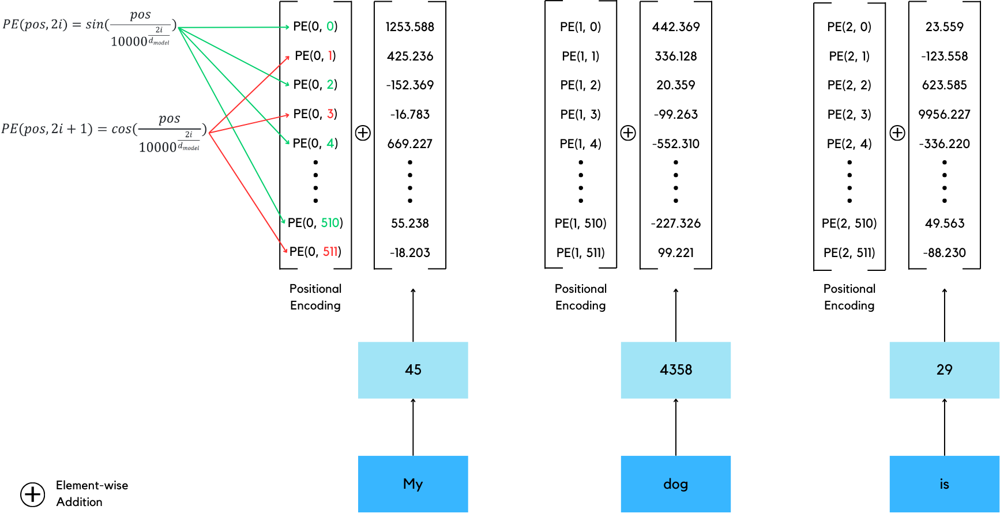
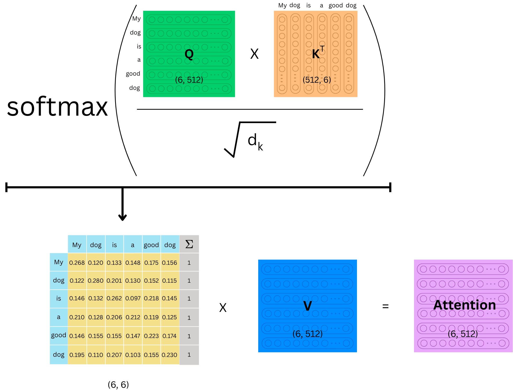
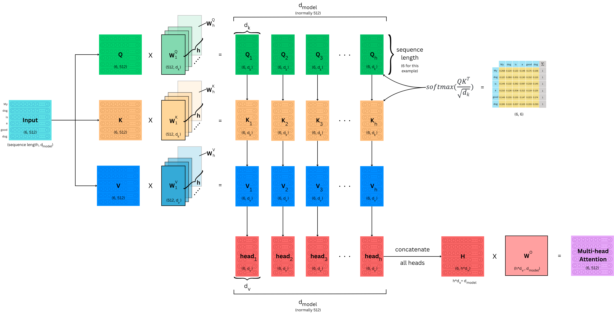
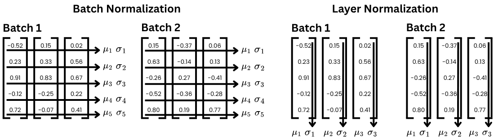

<a href="https://doi.org/10.5281/zenodo.15744091"></a>

# Transformer from scratch using Pytorch

This repository provides a step-by-step implementation of the Transformer architecture from scratch using PyTorch. The Transformer model, introduced in the seminal paper "Attention is All You Need," [[1]](#references) has become the foundation for state-of-the-art natural language processing (NLP) models such as BERT and GPT. In this repository, we break down the core components of the Transformer, including multi-head self-attention, positional encoding, and layer normalization, offering a clear and intuitive understanding of how the model functions. Whether you're a student or researcher looking to deepen your understanding of Transformers or an engineer exploring custom implementations, this repository will guide you through the essential building blocks of this powerful architecture.

> This repository is heavily inspired by the YouTube video by [Umar Jamil](https://www.youtube.com/@umarjamilai), and we would really like to acknowledge his valuable contribution to making Transformers accessible to a broader audience.

## Table of Contents

- [Introduction](#Introduction)
- [Core Components](#Core-Components)
  - [Tokenizer](#Tokenizer)
  - [Input Embedding](#Input-Embedding)
  - [Positional Encoding](#Positional-Encoding)
  - [Multi-Head Attention](#Multi-Head-Attention)
  - [Feedforward Block](#Feedforward-Block)
  - [Residual Connection](#Residual-Connection)
  - [Layer Normalization](#Layer-Normalization)
  - [Projection Layer](#projection-layer)
- [Transformer Model](#Transformer-Model)
  - [Encoder](#Encoder)
  - [Decoder](#Decoder)
- [Training Loop](#Training-Loop)
- [Inference](#inference)
- [Setup](#setup)
- [References](#references)
- [License](#license)
- [Citation](#citation)
- [Contributing](#contributing)
- [Authors](#authors)

## Introduction

When talking about something called a "Transformer", surely, each individual would have a different image in their mind. Many might associate this word with nostalgic movies/toys/cartoons regarding alien robots like Optimus Prime, while those with an electrical engineering background may think of a passive component for altering the voltage. Recently, computer and ML scientists, have also come up with a new definition of this word. Transformer architecture originally proposed in the groundbreaking paper "[Attention is all you need](https://arxiv.org/abs/1706.03762)", was initially introduced to address several limitations and flaws of recurrent neural networks (RNNs), especially in the context of tasks like neural machine translation (NMT) and other sequence-to-sequence tasks. Since then it has become a revolutionary foundation for the field of natural language processing and beyond, serving as the backbone of many modern AI models. A marvelous technology like chatGPT or even a more accurate language translator that we take for granted, would not be possible without this vital architecture as its constituent. It would not be far-fetched to say that this transformer model is a spark for this new era of artificial intelligence technology.

Now without further ado, let's get to know this marvel of technology thoroughly starting with the overall architecture of a transformer.

<p align="center">
  
</p>
<b><i><p align="center">The Transformer Architecture - from Attention is all you need paper</p></i></b>

## Core Components

### Tokenizer

A tokenizer is a vital component for various tasks in machine learning, especially for natural language processing (NLP). The main functionality of this module is to preprocess the raw input text in a way that makes it easier for the machine to deal with afterward. Simply put, the tokenizer module is responsible for breaking down sentences or paragraphs into smaller and more manageable chunks called **tokens**, which can either be words, subwords, or even individual characters, depending on the type of tokenizer used.

A tokenizer is a vital component for various tasks in machine learning, especially for natural language processing (NLP). The main functionality of this module is to preprocess the raw input text in a way that makes it easier for the machine to deal with afterward. Simply put, the tokenizer module is responsible for breaking down sentences or paragraphs into smaller and more manageable chunks called **tokens**, which can be words, subwords, or even individual characters, depending on the type of tokenizer used.

Here are 3 main types of tokenizer.

- **Word-level tokenization** splits text into individual words based on the presence of a delimiter such as whitespace, commas, etc. It is arguably one of the most intuitive types of tokenizer and well-suited for most Western languages that use spaces between words like English. However, such a technique usually falls short when dealing with non-whitespace languages where word boundaries are ambiguous or absent, which are particularly common for Asian languages, namely Japanese, Chinese, and Thai. Moreover, it might require higher vocabulary size, and hence memory storage, especially for morphologically rich language.

  > **Example:** "The cat is sleeping." would be tokenized as: ["The", "cat", "is", "sleeping", "."]

- **Character-level tokenization** splits text into individual characters. This implies that the vocabulary size of this technique could be as small as the number of distinct characters in each language with some extra symbols like digits, punctuation marks, etc. In addition, this approach can also handle any text, including rare, unseen, or out-of-vocabulary (OOV) words, because it breaks words down into individual characters. Nevertheless, it comes with the consequence of requiring much longer token sequences compared to other tokenization techniques. Besides, it is apparent that by employing such a maneuver the input text will surely lose its semantic meaning since individual characters carry little to no semantic meaning by themselves, thus it is harder for the model to capture higher-level relationships and require more training data.

  > **Example:** "The cat is sleeping." would be tokenized as: ["T", "h", "e", " ", "c", "a", "t", " ", "i", "s", " ", "s", "l", "e", "e", "p", "i", "n", "g", "."]

- **Subword-level tokenization** splits text into a chuck, normally smaller than words, called subwords. This technique strikes a balance between word- and character-level tokenization, featuring a manageable vocabulary size and the ability to handle out-of-vocabulary (OOV) words by breaking them into smaller, meaningful subunits. It works well across different languages and is efficient in capturing morphological structures while maintaining reasonable sequence lengths. However, it can produce ambiguous tokenization results depending on the method and may still struggle with rare subwords. Additionally, training subword tokenizers is resource-intensive, and the resulting tokens can be less interpretable compared to word-level tokens.

  > **Example:** "The cat is sleeping." would be tokenized as: ["The", "cat", "is", "sleep", "ing", "."]

### Input Embedding

Subsequent to the tokenization process, input text will be broken down into multiple tokens or words. In this textual form, each token still cannot be comprehended by the computer. Therefore, we must transform these sequences of tokens into a machine-readable format, specifically a vector of numbers. To do so first we map each textual token into a unique ID represented in the form of integer, then pass it through the Embedding layer (very similar to linear layer in neural network). As a result, we derive a vector corresponding to each token.

<p align="center">
  
</p>
<b><i><p align="center">An example of input and output of embeding layer</p></i></b>

From the figure, we can see that the word "dog" is assigned the same token ID and vector embedding each time it appears, regardless of its position in the sequence. This means that using only input embeddings, the model cannot distinguish between instances of the same word based on their order in the sequence. In fact, the model has no understanding of the order of any tokens whatsoever because transformers process all tokens in parallel, without an inherent sense of sequence. This limitation highlights the need for positional encoding, the next crucial component.

**Input Embedding Implementation**

```python
class InputEmbedding(nn.Module):
    def __init__(self, d_model: int, vocab_size: int) -> None:
        super().__init__()
        self.d_model = d_model
        self.embedding = nn.Embedding(vocab_size, d_model)

    def forward(self, x):
        return self.embedding(x) * math.sqrt(self.d_model)
```

### Positional Encoding

Positional encoding, as its name implies, is a component responsible for telling the model the sequence with which each token occurs in the sentence. There are various ways to implement this part, but here, to align with the original paper by Vaswani et al. [[1]](#references), we will implement such a component using a technique called "sinusoidal positional encoding." This approach can be considered a static positional encoding method, meaning it only needs to be computed once and can be reused across all sentences and phases—both during training and inference. Moreover, the paper also claimed that this method allows the model to extrapolate to a sequence length longer than those observed in the training phase.

Now let's see, mathematically, how it is computed from the equations below.

```math
\begin{aligned}
PE(pos, 2i) = sin(\frac{pos}{10000^{\frac{2i}{d_{model}}}}) \\ \\
PE(pos, 2i+1) = cos(\frac{pos}{10000^{\frac{2i}{d_{model}}}})
\end{aligned}
```

where $pos$ indicates the position in which each token resides within the sentence, $2i$ and $2i+1$ denote the even and odd elements of the vector, respectively, and $d_{model}$ demonstrates the length or dimension of the embedding vector, which is set as 512 according to the original paper.

<p align="center">
  
</p>
<b><i><p align="center">An illustration of positional encoding procedure</p></i></b>

**Positional Encoding Implementtion**

```python
class PositionalEncoding(nn.Module):
    def __init__(self, d_model: int, seq_len: int, dropout: float) -> None:
        super().__init__()
        self.dropout = nn.Dropout(dropout)

        # initialize matrix of size (seq_len X d_model)
        pe = torch.zeros(seq_len, d_model)

        # initialize the vector of position of size (seq_len, 1)
        position = torch.arange(0, seq_len, dtype=torch.float).unsqueeze(1)
        div_term = torch.exp(torch.arange(0, d_model, 2).float() * (-math.log(10000.0)/d_model))
        # apply sin to even and cos to odd position
        pe[:, 0::2] = torch.sin(position * div_term)
        pe[:, 1::2] = torch.cos(position * div_term)

        pe = pe.unsqueeze(0) # size (1, seq_len, d_model)

        self.register_buffer('pe', pe)

    def forward(self, x):
        x = x + (self.pe[:, :x.shape[1], :]).requires_grad_(False)
        return self.dropout(x)
```

### Multi-Head Attention

Then, the component that can be considered the heart of the transformer model is the multi-head attention. You may wonder why this technique is so important, and my answer is that it enables the model to relate each word in the sequence to the others, or, in essence, allows for contextual understanding. But in order to understand the actual algorithm behind this mechanism, first we need to understand the scaled dot-product attention, which is a special self-attention mechanism proposed in the paper _Attention Is All You Need_.

**Scaled Dot-product Attention**

Scaled Dot-product attention is very similar to the Dot-product attention algorithm, which was introduced some time before the transformer. The only difference lies in the scaling factor $1/\sqrt d_k$, where $d_k$ is the dimension of the key vectors. This scaling factor is important to mitigate the possible gradient vanishing problem, arising from the high dot product value that causes the output of the softmax function to have a minuscule gradient.

This function processes queries (Q), keys (K), and values (V) by computing dot products (matrix multiplication) between queries matrix and the transposed keys matrix, scaling by $1/\sqrt d_k$, applying softmax to generate a probability distribution, and finally performing matrix multiplication between such matrix and values matrix. This mechanism outperforms traditional dot-product attention for large dimensions of keys ($d_k$) while maintaining computational efficiency through optimized matrix operations, making it faster and more space-efficient than alternative approaches like additive attention that use feed-forward networks for compatibility functions.

```math
Attention(Q,K,V) =softmax(\frac{QK^T}{\sqrt{d_k}})V
```

<p align="center">
  
</p>
<b><i><p align="center">An illustration of Scaled Dot-product Attention</p></i></b>

But upon looking at the diagram, you may wonder where these fancy-named matrices (Query, Key, and Value) come from. What values are actually contained in such matrices? If that's the case, don't feel discouraged. I struggled with that for quite some time as well. The reason is that in the original paper, they never explicitly define these matrices anywhere. Therefore, I will save you the trouble and provide a definition for these matrices here. The query, key, and value matrices are just three exact duplicates of the input matrix, and that's about it, simple as that.

**Multi-Head Attention**

Building upon the previously discussed scaled dot-product attention, the transformer extends this concept to have multiple scaled dot-product attentions in parallel (a.k.a heads), hence the name "Multi-Head Attention." This allows the model to attend to information from different parts of the embedding dimension, thereby enhancing the model's robustness and ability to capture diverse contextual relationships. The equation for this technique is as follows.

```math
\begin{aligned}
MultiHead(Q,K,V) &= Concat(head_1, ... , head_h)W^O \\
& where \ head_i = Attention(QW^Q_i, KW^K_i, VW^V_i)
\end{aligned}
```

where h signifies the number of heads, $W^Q_i \in R^{d_{model} \times d_k}$ indicates a projection matrix of the Query matrix of the $i^{th}$ head, $W^K_i \in R^{d_{model} \times d_k}$ demonstrates a projection matrix of the Key matrix of the $i^{th}$ head, $W^V_i \in R^{d_{model} \times d_v}$ illustrates a projection matrix of the Value matrix of the $i^{th}$ head, and $W^O \in R^{hd_v \times d_{model}}$ shows the projection matrix of the concatenation of all the heads.

<p align="center">
  
</p>
<b><i><p align="center">An illustration of Multi-Head Attention</p></i></b>

The Multi-head attention commences by first creating three duplicates of the input matrix, resulting in the Query (Q), Key (K), and Value (V) matrices. Then, each of these matrices will undergo a separate linear projection using different learned weight matrices for each attention head. Specifically, Q, K, and V are each projected into h lower-dimensional representations, where h is the number of attention heads, and each head learns its own set of projection weights $W^Q_i, W^K_i,$ and $W^V_i$. These projections yield $Q_1, ..., Q_h, K_1, ..., K_h, V_1, ..., V_h$ each with the size of sequence length by $d_k$ (or $d_v$) given that $d_k = d_v = d_{model}/h$. After that, each $head_i$ independently computes scaled dot-product attention (as discussed above) using its corresponding $Q_i, K_i,$ and $V_i$ matrices. Finally, the resulting attention outputs from all heads are then concatenated to form a single matrix, which is passed through a final linear projection $W^O$ to produce the final multi-head attention output.

Note that here, in order to simplify the code, we instead of using $W^Q_i, W^K_i,$ and $W^V_i$ for each head, employ the shared weight of $W^Q, W^K,$ and $W^V$ (each of shape $R^{d_{model} \times d_{model}}$) to perform projection once, then split the resulting matrices along the embedding dimension ($d_{model}$) into h separate heads later.  

**Multi-Head Attention Block Implementtion**

```python
class MultiHeadAttentionBlock(nn.Module):
    def __init__(self, d_model: int, num_head: int, dropout: float) -> None:
        super().__init__()
        self.d_model = d_model
        self.num_head = num_head
        assert d_model % num_head == 0, 'd_model must be divisible by num_head'

        self.d_k = d_model // num_head
        self.w_q = nn.Linear(d_model, d_model)
        self.w_k = nn.Linear(d_model, d_model)
        self.w_v = nn.Linear(d_model, d_model)

        self.w_o = nn.Linear(d_model, d_model)
        self.dropout = nn.Dropout(dropout)

    @staticmethod
    def attention(query, key, value, mask, dropout: nn.Dropout):
        d_k = query.shape[-1]

        # (batch, num_head, seq_len, d_k) --> (batch, num_head, seq_len, seq_len)
        attention_score = (query @ key.transpose(-2, -1)) / math.sqrt(d_k)
        if mask is not None:
            attention_score.masked_fill_(mask == 0, -1e9)
        attention_score = attention_score.softmax(dim=-1) # (batch, num_head, seq_len, seq_len)
        if dropout is not None:
            attention_score = dropout(attention_score)

        return (attention_score @ value), attention_score

    def forward(self, q, k, v, mask):
        query = self.w_q(q) # (batch, seq_len, d_model) --> (batch, seq_len, d_model)
        key = self.w_k(k) # (batch, seq_len, d_model) --> (batch, seq_len, d_model)
        value = self.w_v(v) # (batch, seq_len, d_model) --> (batch, seq_len, d_model)

        # (batch, seq_len, d_model) --> (batch, seq_len, num_head, d_k) --> (batch, num_head, seq_len, d_k)
        query = query.view(query.shape[0], query.shape[1], self.num_head, self.d_k).transpose(1,2)
        key = key.view(key.shape[0], key.shape[1], self.num_head, self.d_k).transpose(1,2)
        value = value.view(value.shape[0], value.shape[1], self.num_head, self.d_k).transpose(1,2)

        x, self.attention_score = MultiHeadAttentionBlock.attention(query, key, value, mask, self.dropout)

        # (batch, num_head, seq_len, d_k) --> (batch, seq_len, num_head, d_k) --> (batch, seq_len, d_model)
        x = x.transpose(1,2).contiguous().view(x.shape[0], -1, self.num_head*self.d_k)

        # (batch, seq_len, d_model) --> (batch, seq_len, d_model)
        return self.w_o(x)
```

### Feedforward Block

Another crucial component in both the encoder and decoder of the Transformer architecture is the feedforward block. Each of these blocks contains two fully connected feedforward layers (linear layers) with a ReLU activation function in between. Notice that in the original paper, this component is referred to as the "position-wise feedforward network". This name simply indicates that this component takes each token (position in the input sequence) as input and processes it independently, while using the same linear transformation (same network weights and biases) across all positions. The default parameters according to the original paper are: dimensionality of input and output $(d_{model})$ is 512, and dimensionality of the hidden layer $(d_{ff})$ is 2048.

**Feedforward Block Implementation**

```python
class FeedForwardBlock(nn.Module):
    def __init__(self, d_model: int, d_ff: int, dropout: float) -> None:
        super().__init__()
        self.linear1 = nn.Linear(d_model, d_ff) # W1 and b1
        self.dropout = nn.Dropout(dropout)
        self.linear2 = nn.Linear(d_ff, d_model) # W2 and b2

    def forward(self, x):
        x = self.linear1(x) # (batch, seq_len, d_model) --> (batch, seq_len, d_ff)
        x = torch.relu(x)
        x = self.dropout(x)
        out = self.linear2(x) # (batch, seq_len, d_ff) --> (batch, seq_len, d_model)
        return out
```

### Residual Connection

Residual connections, also known as skip connections, are a special mechanism that allows information and gradients to bypass one or more computational layers. This technique was developed to tackle issues in the training process of very deep learning networks, particularly the vanishing gradient problem, and became widely popular following the introduction of ResNet [[2]](#references) in 2015.

**Residual Connection Implementation**

```python
class ResidualConnection(nn.Module):
    def __init__(self, dropout: float) -> None:
        super().__init__()
        self.dropout = nn.Dropout(dropout)
        self.norm = LayerNormalization()

    def forward(self, x, sublayer):
        return x + self.dropout(sublayer(self.norm(x)))
```

### Layer Normalization

The normalization process is another crucial concept that helps learning algorithms converge more swiftly and stably. There are two popular normalization techniques utilized in the deep learning community: batch normalization and layer normalization.

If you are familiar with deep learning applications in computer vision tasks, you may have heard of batch normalization. This normalization strategy, as the name implies, normalizes the information across the entire batch for each feature independently, as shown below.

<p align="center">
  
</p>
<b><i><p align="center">Layer Normalization vs Batch Normalization</p></i></b>

Although batch normalization works well for computer vision tasks, it falls short when dealing with sequence data such as text, processing data with small batch sizes, and handling variable-length sequences. The key issues with batch normalization for sequence data include:

1. **Variable sequence lengths**: In NLP tasks, sentences have different lengths, making it unclear how to compute consistent normalization statistics across batches with varying sequence lengths.
2. **Batch dependency**: Normalization statistics depend on other samples in the batch, which can lead to inconsistent behavior across different batch compositions.
3. **Small batch size instability**: With small batches, the computed statistics become unreliable and noisy.

Therefore, in 2016, a novel normalization technique called "layer normalization" [[3]](#references) was introduced to address these limitations of batch normalization, particularly for models that process sequence data such as recurrent neural networks (RNNs). Layer normalization normalizes each data point using statistics computed for that specific data point independently. Specifically, it computes the mean and variance across all features (the feature dimension) for each individual sample, rather than across the batch dimension.

This approach eliminates the dependency of normalization on the batch size and composition and provides stable normalization regardless of sequence length, while still delivering the benefits of normalization for training stability and convergence speed.

**Layer Normalization Implementation**

```python
class LayerNormalization(nn.Module):
    def __init__(self, epsilon: float = 10**-6) -> None:
        super().__init__()
        self.epsilon = epsilon
        self.alpha = nn.Parameter(torch.ones(1)) # Multiplicative
        self.bias = nn.Parameter(torch.zeros(1)) # Additive

    def forward(self, x):
        mean = x.mean(dim = -1, keepdim=True)
        std = x.std(dim = -1, keepdim=True)
        return self.alpha * (x - mean) / (std + self.epsilon) + self.bias
```

### Projection Layer

Lastly, the projection layer in a Transformer is simply a linear layer that maps the model’s internal representation (with dimension $d_{model} = 512$) to the vocabulary space. This layer produces a score (logit) for each word in the vocabulary, representing how likely each word is to be the next token, given the current hidden state. A softmax function is typically applied afterward to convert these logits into a probability distribution over the vocabulary.

**Projection Layer Implementation**

```python
class ProjectionLayer(nn.Module):
    def __init__(self, d_model: int, vocab_size: int) -> None:
        super().__init__()
        self.projection = nn.Linear(d_model, vocab_size)

    def forward(self, x):
        # (batch, seq_len, d_model) --> (batch, seq_len, vocab_size)
        return torch.log_softmax(self.projection(x), dim=-1)
```

## Transformer Model

Now, let us integrate all the components mentioned previously into a unified Transformer architecture. The Transformer model consists of two main parts: the encoder and the decoder. Each of these components is constructed from a stack of 6 identical layers called encoder blocks and decoder blocks, respectively. Finally, the output from the encoder-decoder architecture is passed to the projection layer to map the internal representation into vocabulary space, and then the softmax function is applied to return the probability distribution over all possible next tokens.

**Transformer Implementation**

```python
class Transformer(nn.Module):
    """ Create an instance for transformer model.

    Create a transformer model with encoder, decoder, source embedding, target embedding, source positional encoding, target positional encoding, and projection layer.

    Attributes:
        encoder: A Encoder layer.
        decoder: A Decoder layer.
        src_embed: A InputEmbedding layer.
        tgt_embed: A InputEmbedding layer.
        src_pos: A PositionalEncoding layer.
        tgt_pos: A PositionalEncoding layer.
        projection_layer: A ProjectionLayer layer.
    """
    def __init__(self, encoder: Encoder, decoder: Decoder, src_embed: InputEmbedding, tgt_embed: InputEmbedding, src_pos: PositionalEncoding, tgt_pos: PositionalEncoding, projection_layer: ProjectionLayer) -> None:
        """ Initialize the transformer model.

        Args:
            encoder: A Encoder layer.
            decoder: A Decoder layer.
            src_embed: A InputEmbedding layer.
            tgt_embed: A InputEmbedding layer.
            src_pos: A PositionalEncoding layer.
            tgt_pos: A PositionalEncoding layer.
            projection_layer: A ProjectionLayer layer.
        """
        super().__init__()
        self.encoder = encoder
        self.decoder = decoder
        self.src_embed = src_embed
        self.tgt_embed = tgt_embed
        self.src_pos = src_pos
        self.tgt_pos = tgt_pos
        self.projection_layer = projection_layer

    def encode(self, src, src_mask):
        """ Encode the source sequence.

        This function will embed the source sequence, add the positional encoding, and feed it into the encoder.

        Args:
            src: A tensor representing the source sequence.
            src_mask: A tensor representing the source mask.

        Returns:
            A tensor representing the output of the encoder.
        """
        src = self.src_embed(src)
        src = self.src_pos(src)
        return self.encoder(src, src_mask)

    def decode(self, encoder_output, src_mask, tgt, tgt_mask):
        """ Decode the target sequence.

        This function will embed the target sequence, add the positional encoding, and feed it into the decoder.

        Args:
            encoder_output: A tensor representing the output of the encoder.
            src_mask: A tensor representing the source mask.
            tgt: A tensor representing the target sequence.
            tgt_mask: A tensor representing the target mask.

        Returns:
            A tensor representing the output of the decoder.
        """
        tgt = self.tgt_embed(tgt)
        tgt = self.tgt_pos(tgt)
        return self.decoder(tgt, encoder_output, src_mask, tgt_mask)

    def project(self, x):
        """ Project the output of the decoder to the target vocabulary.

        This function will apply the projection layer to the output of the decoder, and return the result.

        Args:
            x: A tensor representing the output of the decoder.

        Returns:
            A tensor representing the output of the projection layer.
        """
        return self.projection_layer(x)

def build_transformer(src_vocab_size: int, tgt_vocab_size: int, src_seq_len: int, tgt_seq_len: int, d_model: int = 512, N: int = 6, h: int = 8, dropout: float = 0.1, d_ff: int = 2048) -> Transformer:
    """Build a transformer model.

    Args:
        src_vocab_size (int): The number of unique words in the source language.
        tgt_vocab_size (int): The number of unique words in the target language.
        src_seq_len (int): The length of the sequence in the source language.
        tgt_seq_len (int): The length of the sequence in the target language.
        d_model (int, optional): The dimensionality of the model. Defaults to 512.
        N (int, optional): The number of encoder and decoder layers. Defaults to 6.
        h (int, optional): The number of heads in the multi-head attention. Defaults to 8.
        dropout (float, optional): The dropout rate. Defaults to 0.1.
        d_ff (int, optional): The dimensionality of the feed forward layer. Defaults to 2048.

    Returns:
        Transformer: The transformer model.
    """
    # Create embedding layers
    src_embed = InputEmbedding(d_model, src_vocab_size)
    tgt_embed = InputEmbedding(d_model, tgt_vocab_size)

    # Create positional encoding layers
    src_pos = PositionalEncoding(d_model, src_seq_len, dropout)
    tgt_pos = PositionalEncoding(d_model, tgt_seq_len, dropout)

    # Create Encoder blocks
    encoder_blocks = []
    for _ in range(N):
        encoder_self_attention_block = MultiHeadAttentionBlock(d_model, h, dropout)
        feed_forward_block = FeedForwardBlock(d_model, d_ff, dropout)
        encoder_block = EncoderBlock(encoder_self_attention_block, feed_forward_block, dropout)
        encoder_blocks.append(encoder_block)

    # Create Decoder blocks
    decoder_blocks = []
    for _ in range(N):
        decoder_self_attention_block = MultiHeadAttentionBlock(d_model, h, dropout)
        decoder_cross_attention_block = MultiHeadAttentionBlock(d_model, h, dropout)
        feed_forward_block = FeedForwardBlock(d_model, d_ff, dropout)
        decoder_block = DecoderBlock(decoder_self_attention_block, decoder_cross_attention_block, feed_forward_block, dropout)
        decoder_blocks.append(decoder_block)

    # Create Encoder and Decoder
    encoder = Encoder(nn.ModuleList(encoder_blocks))
    decoder = Decoder(nn.ModuleList(decoder_blocks))

    # Create projection layer
    projection_layer = ProjectionLayer(d_model, tgt_vocab_size)

    # Create Transformer
    transformer = Transformer(encoder, decoder, src_embed, tgt_embed, src_pos, tgt_pos, projection_layer)

    # initialize the parameters
    for p in transformer.parameters():
        if p.dim() > 1:
            nn.init.xavier_uniform_(p)

    return transformer
```

### Encoder

As discussed above, the encoder consists of 6 repeating encoder blocks, each of which has two sub-layers: the multi-head attention sub-layer and the fully connected feedforward sub-layer. The residual connection was then applied to these sub-layers, followed by layer normalization.

**Encoder Block Implementation**

```python
class EncoderBlock(nn.Module):
    """ Create an instance for encoder block component.

    Create a encoder block with self attention and feed forward block.

    Attributes:
        self_attention_block: A MultiHeadAttentionBlock layer.
        feed_forward_block: A FeedForwardBlock layer.
        residual_connection: A ResidualConnection layer.
    """
    def __init__(self, self_attention_block: MultiHeadAttentionBlock, feed_forward_block: FeedForwardBlock, dropout: float) -> None:
        """ Initialize the encoder block layer.

        Args:
            self_attention_block: A MultiHeadAttentionBlock layer.
            feed_forward_block: A FeedForwardBlock layer.
            dropout: A Float representing the dropout rate.
        """
        super().__init__()
        self.self_attention_block = self_attention_block
        self.feed_forward_block = feed_forward_block
        self.residual_connection = nn.ModuleList([ResidualConnection(dropout) for _ in range(2)])

    def forward(self, x, src_mask):
        """ Forward function for encoder block layer.

        This function will pass the input through multi-head attention, feed forward block and perform the residual connection.

        Args:
            x: A tensor representing the input.
            src_mask: A tensor representing the source mask.

        Returns:
            A tensor representing the output of the encoder block layer.
        """
        x = self.residual_connection[0](x, lambda x: self.self_attention_block(x, x, x, src_mask))
        x = self.residual_connection[1](x, self.feed_forward_block)
        return x
```

**Encoder Implementation**

```python
class Encoder(nn.Module):
    """ Create an instance for encoder component.

    Create a encoder with multiple encoder block.

    Attributes:
        layers: A ModuleList of EncoderBlock layers.
        norm: A LayerNormalization layer.
    """
    def __init__(self, layers: nn.ModuleList) -> None:
        """ Initialize the encoder layer.

        Args:
            layers: A ModuleList of EncoderBlock layers.
        """
        super().__init__()
        self.layers = layers
        self.norm  = LayerNormalization()

    def forward(self, x, mask):
        """ Forward function for encoder layer.

        This function will pass the input through multiple encoder block and perform the layer normalization.

        Args:
            x: A tensor representing the input.
            mask: A tensor representing the source mask.

        Returns:
            A tensor representing the output of the encoder layer.
        """
        for layer in self.layers:
            x = layer(x, mask)
        return self.norm(x)
```

### Decoder

The decoder also consists of 6 repeating layers of decoder blocks. Each decoder block is very similar to the encoder block; the main difference is that the decoder block has an additional multi-head attention sub-layer that performs the attention mechanism over the encoder's output, specifically using the encoder's output as Key and Value matrices, while the Query matrix comes from the output from previous layer of the decoder itself. All sub-layers in the decoder are also subject to residual connections.

Note that, for the decoder part, the first self-attention sub-layer is a masked multi-head self-attention, which is modified so that it solely attends to prior positions, ensuring that the prediction of the current position i depends solely on the known information of the output (positions less than i)

**Decoder Block Implementation**

```python
class DecoderBlock(nn.Module):
    """ Create an instance for decoder block component.

    Create a decoder block with self attention, cross attention, feed forward block, and the residual connection.

    Attributes:
        self_attention: A MultiHeadAttentionBlock layer.
        cross_attention: A MultiHeadAttentionBlock layer.
        feed_forward_block: A FeedForwardBlock layer.
        residual_connection: A ResidualConnection layer.
    """
    def __init__(self, self_attention: MultiHeadAttentionBlock, cross_attention: MultiHeadAttentionBlock, feed_forward_block: FeedForwardBlock, dropout: float) -> None:
        """ Initialize the decoder block layer.

        Args:
            self_attention: A MultiHeadAttentionBlock layer.
            cross_attention: A MultiHeadAttentionBlock layer.
            feed_forward_block: A FeedForwardBlock layer.
            dropout: A Float representing the dropout rate.
        """
        super().__init__()
        self.self_attention = self_attention
        self.cross_attention = cross_attention
        self.feed_forward_block = feed_forward_block
        self.residual_connection = nn.ModuleList([ResidualConnection(dropout) for _ in range(3)])

    def forward(self, x, encoder_output, src_mask, tgt_mask):
        """ Forward function for decoder block layer.

        This function will pass the input through multiple attention and feed forward block, and perform the residual connection.

        Args:
            x: A tensor representing the input.
            encoder_output: A tensor representing the output of the encoder layer.
            src_mask: A tensor representing the source mask.
            tgt_mask: A tensor representing the target mask.

        Returns:
            A tensor representing the output of the decoder block layer.
        """
        x = self.residual_connection[0](x, lambda x: self.self_attention(x, x, x, tgt_mask))
        x = self.residual_connection[1](x, lambda x: self.cross_attention(x, encoder_output, encoder_output, src_mask))
        x = self.residual_connection[2](x, self.feed_forward_block)
        return x
```

**Decoder Implementation**

```python
class Decoder(nn.Module):
    """ Create an instance for decoder component.

    Create a decoder with multiple decoder block.

    Attributes:
        layers: A ModuleList of DecoderBlock layers.
        norm: A LayerNormalization layer.
    """
    def __init__(self, layers: nn.ModuleList) -> None:
        """ Initialize the decoder layer.

        Args:
            layers: A ModuleList of DecoderBlock layers.
        """
        super().__init__()
        self.layers = layers
        self.norm = LayerNormalization()

    def forward(self, x, encoder_output, src_mask, tgt_mask):
        """ Forward function for decoder layer.

        This function will pass the input through multiple decoder block, and perform the layer normalization.

        Args:
            x: A tensor representing the input.
            encoder_output: A tensor representing the output of the encoder layer.
            src_mask: A tensor representing the source mask.
            tgt_mask: A tensor representing the target mask.

        Returns:
            A tensor representing the output of the decoder layer.
        """
        for layer in self.layers:
            x = layer(x, encoder_output, src_mask, tgt_mask)
        return self.norm(x)
```

## Training Loop

To train a Transformer model for neural machine translation, we utilize a specialized type of labeled dataset known as a parallel corpus, which comprises extensive collections of text sequences in the source language and their corresponding translations in the target language.

During training, the input sentence in the source language is wrapped with special tokens such as the start-of-sentence (`<SOS>`) and end-of-sentence (`<EOS>`) tokens, then passed into the encoder. At the same time, the target sentence is prepended with the `<SOS>` token and fed into the decoder. Note that both the input to the encoder and the decoder will also be appended with the (`<PAD>`) tokens to make the sequence length consistent across different examples in a training batch. This padding ensures that all sequences align to a uniform length, allowing for efficient batch processing. Importantly, attention masks are used so that the model does not attend to these padding positions during computation. 

The transformer generates output representations, which are then passed through a projection layer (a linear layer) that maps them from the model's internal representation space to the vocabulary space. Finally, a softmax function is applied to convert these logits into a probability distribution over the target vocabulary, thereby determining the most probable prediction for the next token.

Another essential point to note is that, unlike its predecessor models, such as recurrent neural networks (RNNs), during the training phase, the Transformer models process the entire input sequence in parallel. This means that each input-output pair can be processed within a single forward pass, making the training significantly more efficient. In contrast, an RNN model processes the input sequence token by token at each timestep, making it inherently slower and less efficient.

```python
def train_model(config):
    # Define the device
    device = torch.device("cuda" if torch.cuda.is_available() else "cpu")
    print(f'Device: {device}')

    Path(config["model_folder"]).mkdir(parents=True, exist_ok=True)

    train_dataloader, test_dataloader, tokenizer_src, tokenizer_tgt = get_dataset(config)
    model = get_model(config, tokenizer_src.get_vocab_size(), tokenizer_tgt.get_vocab_size()).to(device)

    # Initialize tensorboard
    writer = SummaryWriter(config["experiment_name"])

    optimizer = torch.optim.Adam(model.parameters(), lr=config["lr"], eps=1e-9)

    initial_epoch = 0
    global_step = 0
    if config["preload"]:
        model_filename = get_weights_file_path(config, config["preload"])
        print(f"Preloading model {model_filename}")
        state = torch.load(model_filename)
        initial_epoch = state["epoch"] + 1
        optimizer.load_state_dict(state["optimizer_state_dict"])
        global_step = state["global_step"]

    loss_fn = nn.CrossEntropyLoss(ignore_index=tokenizer_src.token_to_id('[PAD]'), label_smoothing=0.1).to(device)

    for epoch in range(initial_epoch, config["num_epochs"]):
        batch_iterator = tqdm(train_dataloader, desc=f"Processing Epoch {epoch: 02d}")

        for batch in batch_iterator:
            model.train()

            encoder_input = batch["encoder_input"].to(device) # (batch, seq_len)
            decoder_input = batch["decoder_input"].to(device) # (batch, seq_len)
            encoder_mask = batch["encoder_mask"].to(device) # (batch, 1, 1, seq_len)
            decoder_mask = batch["decoder_mask"].to(device) # (batch, 1, seq_len, seq_len)

            # Run tensor through the transformer
            encoder_output = model.encode(encoder_input, encoder_mask) # (batch, seq_len, d_model)
            decoder_output = model.decode(encoder_output, encoder_mask, decoder_input, decoder_mask) # (batch, seq_len, d_model)
            proj_output = model.project(decoder_output) # (batch, seq_len, tgt_vocab_size)

            label = batch["label"].to(device) # (batch, seq_len)

            # (batch, seq_len, tgt_vocab_size) --> (batch * seq_len, tgt_vocab_size)
            loss = loss_fn(proj_output.view(-1, tokenizer_tgt.get_vocab_size()), label.view(-1))
            batch_iterator.set_postfix({f"Loss": f"{loss.item():6.3f}"})

            # Log the loss
            writer.add_scalar('train loss', loss.item(), global_step)
            writer.flush()

            # Backprop the loss
            loss.backward()

            # Update the weights
            optimizer.step()
            optimizer.zero_grad()

            global_step += 1

        run_validation(model, test_dataloader, tokenizer_src, tokenizer_tgt, config['seq_len'], device, lambda msg: batch_iterator.write(msg), global_step, writer)

        # Save the model
        model_filename = get_weights_file_path(config, f'{epoch:02d}')
        torch.save({
            'epoch': epoch,
            'model_state_dict': model.state_dict(),
            'optimizer_state_dict': optimizer.state_dict(),
            'global_step': global_step
        }, model_filename)
```

## Inference

After understanding the process for training the Transformer model, what is left now is to learn how to use such a model, in this case, to do the neural machine translation (NMT) task. First, what we need to understand is that the Transformer model performs inference in an autoregressive manner. By autoregressive, it means that the model generates each output one step at a time, where each prediction depends on the previous outputs, or simply put, building the output token by token, unlike training, where the entire target sequence is available and processed in parallel. This step-by-step generation continues until a special end-of-sequence token (`<EOS>`) is produced or a predefined maximum sequence length is reached.

The process begins by tokenizing and embedding the input sentence in the source language, before passing it to the encoder to process the whole sequence in parallel and produce a series of contextualized vector representations. These encoder outputs are computed only once and reused at every decoding step.

For the decoder part, at the first time step, the input will be initialized with a sequence containing just the start-of-sequence token (`<SOS>`). At each decoding step, the decoder takes the current sequence of previously generated tokens and processes them through several layers of masked self-attention and encoder-decoder attention. Masking ensures that, at position t, the decoder cannot attend to positions t+1 or beyond, preserving the causal, autoregressive property.

After computing the decoder outputs, the model applies a linear transformation followed by a softmax function to produce a probability distribution over the entire vocabulary. From this distribution, the next token is selected—commonly via argmax (greedy decoding) or beam search (for higher quality outputs). This token is then appended to the input sequence for the next decoding step.

The loop repeats, with the decoder now having one more token in its input. At each step, the model reprocesses the growing sequence, always conditioned on the full encoder output and the previously predicted tokens. Once the model outputs the `<EOS>` token or reaches the maximum allowed length, the generation loop terminates. The final output sequence consists of all predicted tokens up to (but not including) `<EOS>`.

In summary, Transformer inference consists of repeatedly predicting the next token one step at a time, conditioned on both the fixed encoder output and all previously generated tokens.

```python
def greedy_decode(model, source, source_mask, tokenizer_src, tokenizer_tgt, max_len, device):
    sos_idx = tokenizer_tgt.token_to_id('[SOS]')
    eos_idx = tokenizer_tgt.token_to_id('[EOS]')

    # Precompute the encoder output and reuse it for every token we get from the decoder
    encoder_output = model.encode(source, source_mask)
    # Initialize the decoder input with the sos token
    decoder_input = torch.empty(1, 1).fill_(sos_idx).type_as(source).to(device)
    while True:
        if decoder_input.size(1) == max_len:
            break

        # Build mask for the target (decoder input)
        decoder_mask = causal_mask(decoder_input.size(1)).type_as(source_mask).to(device)

        # Calculate the output of the decoder
        out = model.decode(encoder_output, source_mask, decoder_input, decoder_mask)

        # Get the next token
        prob = model.project(out[:, -1])
        # Select the token with max probability
        _, next_word = torch.max(prob, dim=1)
        decoder_input = torch.cat([decoder_input, torch.empty(1, 1).type_as(source).fill_(next_word.item()).to(device)], dim=1)

        if next_word == eos_idx:
            break

    return decoder_input.squeeze(0)
```

## Setup

### Prerequisites

Ensure you have the following installed:

- **Python 3.9+**

### Installation

1. **Clone the repository:**

   ```bash
   git clone https://github.com/SirawitC/Transformer_from_scratch_pytorch.git
   cd Transformer_from_scratch_pytorch
   ```

2. **Create a virtual environment:**

   ```bash
   python -m venv env
   source env/bin/activate  # Linux/Mac
   env\Scripts\activate  # Windows
   ```

3. **Install dependencies:**
   ```bash
   pip install -r requirements.txt
   ```

### Running the Project

After installation, you can run the training script as follows:

```bash
python train.py
```

Adjust parameters and configurations in `config.py` to experiment with different model settings.

## References

[1] Vaswani, A., Shazeer, N., Parmar, N., Uszkoreit, J., Jones, L., Gomez, A. N., Kaiser, Ł., & Polosukhin, I. (2017). [Attention is all you need](https://papers.nips.cc/paper/2017/file/3f5ee243547dee91fbd053c1c4a845aa-Paper.pdf). In _Advances in Neural Information Processing Systems 30 (NeurIPS 2017)_.

[2] He, K., Zhang, X., Ren, S., & Sun, J. (2016). [Deep residual learning for image recognition](https://ieeexplore.ieee.org/document/7780459). In Proceedings of the _IEEE conference on computer vision and pattern recognition_ (pp. 770-778).

[3] Ba, J. L., Kiros, J. R., & Hinton, G. E. (2016). [Layer normalization](https://arxiv.org/abs/1607.06450). arXiv preprint arXiv:1607.06450.

## License

This code is licensed under the MIT License. See the [LICENSE](LICENSE) file for more details.

## Citation

If you find our work helpful or use any part of this repository in your research, please consider citing this repository:

```
@software{sorawit_chokphantavee_2025_15744092,
  author       = {Sorawit Chokphantavee and
                  Sirawit Chokphantavee},
  title        = {SirawitC/Transformer\_from\_scratch\_pytorch:
                   Transformer from scratch pytorch
                  },
  month        = jun,
  year         = 2025,
  publisher    = {Zenodo},
  version      = {v1.0.0},
  doi          = {10.5281/zenodo.15744092},
  url          = {https://doi.org/10.5281/zenodo.15744092}
}
```

## Contributing

Feel free to fork this repository and submit pull requests. Any contributions are welcome!

## Authors

This repository was created by [Sorawit Chokphantavee](https://github.com/SorawitChok) and [Sirawit Chokphantavee](https://github.com/SirawitC).

