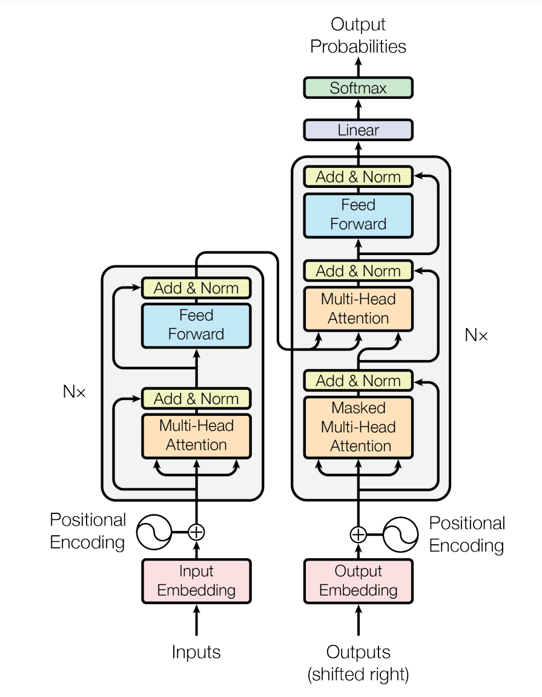
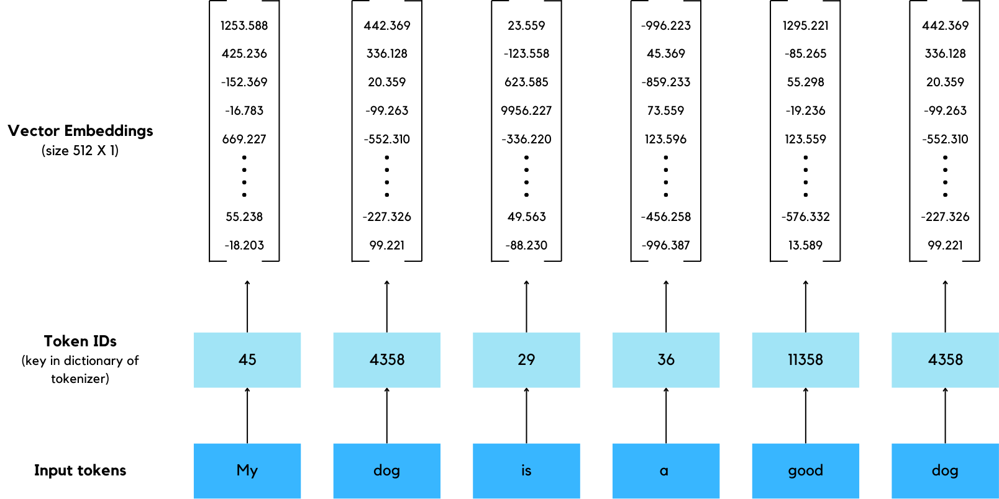

# Transformer from scratch using Pytorch

This repository provides a step-by-step implementation of the Transformer architecture from scratch using PyTorch. The Transformer model, introduced in the seminal paper "Attention is All You Need," has become the foundation for state-of-the-art natural language processing (NLP) models such as BERT and GPT. In this repository, we break down the core components of the Transformer, including multi-head self-attention, positional encoding, and layer normalization, offering a clear and intuitive understanding of how the model functions. Whether you're a student or researcher looking to deepen your understanding of Transformers or an engineer exploring custom implementations, this repository will guide you through the essential building blocks of this powerful architecture.

> This repository is heavily inspired by the YouTube video by [Umar Jamil](https://www.youtube.com/@umarjamilai), and we would really like to acknowledge his valuable contribution to making Transformers accessible to a broader audience.

## Table of Contents

- [Introduction](#Introduction)
- [Core Components](#Core-Components)
  - [Tokenizer](#Tokenizer)
  - [Input Embedding](#Input-Embedding)
  - [Positional Encoding](#Positional-Encoding)
  - [Multi-Head Attention](#Multi-Head-Attention)
  - [Feedforward Block](#Feedforward-Block)
  - [Residual Connection](#Residual-Connection)
  - [Layer Normalization](#Layer-Normalization)
  - [Projection Layer](#projection-layer)
- [Transformer Model](#Transformer-Model)
  - [Encoder](#Encoder)
  - [Decoder](#Decoder)
- [Training Loop](#Training-Loop)
- [Inference](#Inference)
- [Setup](#setup)
- [License](#license)

## Introduction

When talking about something called a "Transformer", surely, each individual would have a different image in their mind. Many might associate this word with nostalgic movies/toys/cartoons regarding alien robots like Optimus Prime, while those with an electrical engineering background may think of a passive component for altering the voltage. Recently, computer and ML scientists, have also come up with a new definition of this word. Transformer architecture originally proposed in the groundbreaking paper "[Attention is all you need](https://arxiv.org/abs/1706.03762)", was initially introduced to address several limitations and flaws of recurrent neural networks (RNNs), especially in the context of tasks like neural machine translation (NMT) and other sequence-to-sequence tasks. Since then it has become a revolutionary foundation for the field of natural language processing and beyond, serving as the backbone of many modern AI models. A marvelous technology like chatGPT or even a more accurate language translator that we take for granted, would not be possible without this vital architecture as its constituent. It would not be far-fetched to say that this transformer model is a spark for this new era of artificial intelligence technology.

Now without further ado, let's get to know this marvel of technology thoroughly starting with the overall architecture of a transformer.

<p align="center">
  
</p>
<b><i><p align="center">The Transformer Architecture - from Attention is all you need paper</p></i></b>

## Core Components

### Tokenizer

A tokenizer is a vital component for various tasks in machine learning, especially for natural language processing (NLP). The main functionality of this module is to preprocess the raw input text in a way that makes it easier for the machine to deal with afterward. Simply put, the tokenizer module is responsible for breaking down sentences or paragraphs into smaller and more manageable chunks called **tokens**, which can either be words, subwords, or even individual characters, depending on the type of tokenizer used.

A tokenizer is a vital component for various tasks in machine learning, especially for natural language processing (NLP). The main functionality of this module is to preprocess the raw input text in a way that makes it easier for the machine to deal with afterward. Simply put, the tokenizer module is responsible for breaking down sentences or paragraphs into smaller and more manageable chunks called **tokens**, which can be words, subwords, or even individual characters, depending on the type of tokenizer used.

Here are 3 main types of tokenizer.

- **Word-level tokenization** splits text into individual words based on the presence of a delimiter such as whitespace, commas, etc. It is arguably one of the most intuitive types of tokenizer and well-suited for most Western languages that use spaces between words like English. However, such a technique usually falls short when dealing with non-whitespace languages where word boundaries are ambiguous or absent, which are particularly common for Asian languages, namely Japanese, Chinese, and Thai. Moreover, it might require higher vocabulary size, and hence memory storage, especially for morphologically rich language.

  > **Example:** "The cat is sleeping." would be tokenized as: ["The", "cat", "is", "sleeping", "."]

- **Character-level tokenization** splits text into individual characters. This implies that the vocabulary size of this technique could be as small as the number of distinct characters in each language with some extra symbols like digits, punctuation marks, etc. In addition, this approach can also handle any text, including rare, unseen, or out-of-vocabulary (OOV) words, because it breaks words down into individual characters. Nevertheless, it comes with the consequence of requiring much longer token sequences compared to other tokenization techniques. Besides, it is apparent that by employing such a maneuver the input text will surely lose its semantic meaning since individual characters carry little to no semantic meaning by themselves, thus it is harder for the model to capture higher-level relationships and require more training data.

  > **Example:** "The cat is sleeping." would be tokenized as: ["T", "h", "e", " ", "c", "a", "t", " ", "i", "s", " ", "s", "l", "e", "e", "p", "i", "n", "g", "."]

- **subword-level tokenization** splits text into a chuck, normally smaller than words, called subwords. This technique strikes a balance between word- and character-level tokenization, featuring a manageable vocabulary size and the ability to handle out-of-vocabulary (OOV) words by breaking them into smaller, meaningful subunits. It works well across different languages and is efficient in capturing morphological structures while maintaining reasonable sequence lengths. However, it can produce ambiguous tokenization results depending on the method and may still struggle with rare subwords. Additionally, training subword tokenizers is resource-intensive, and the resulting tokens can be less interpretable compared to word-level tokens.

  > **Example:** "The cat is sleeping." would be tokenized as: ["The", "cat", "is", "sleep", "ing", "."]

### Input Embedding

Subsequent to the tokenization process, input text will be broken down into multiple tokens or words. In this textual form, each token still cannot be comprehended by the computer. Therefore, we must transform these sequences of tokens into a machine-readable format, specifically a vector of numbers. To do so first we map each textual token into a unique ID represented in the form of integer, then pass it through the Embedding layer (very similar to linear layer). As a result, we derive a vector corresponding to each token.

<p align="center">
  
</p>
<b><i><p align="center">An example of input and output of embeding layer</p></i></b>

From the figure, we can see that the word "dog" is assigned the same token ID and vector embedding each time it appears, regardless of its position in the sequence. This means that using only input embeddings, the model cannot distinguish between instances of the same word based on their order in the sequence. In fact, the model has no understanding of the order of any tokens whatsoever because transformers process all tokens in parallel, without an inherent sense of sequence. This limitation highlights the need for positional encoding, the next crucial component.

**Input Embedding Implementation**

```python
class InputEmbedding(nn.Module):
    def __init__(self, d_model: int, vocab_size: int) -> None:
        super().__init__()
        self.d_model = d_model
        self.embedding = nn.Embedding(vocab_size, d_model)

    def forward(self, x):
        return self.embedding(x) * math.sqrt(self.d_model)
```

### Positional Encoding

```math
\begin{aligned}
PE(pos, 2i) = sin(\frac{pos}{10000^{\frac{2i}{d_{model}}}}) \\ \\
PE(pos, 2i+1) = cos(\frac{pos}{10000^{\frac{2i}{d_{model}}}})
\end{aligned}
```

**Positional Encoding Implementtion**

```python
class PositionalEncoding(nn.Module):
    def __init__(self, d_model: int, seq_len: int, dropout: float) -> None:
        super().__init__()
        self.dropout = nn.Dropout(dropout)

        # initialize matrix of size (seq_len X d_model)
        pe = torch.zeros(seq_len, d_model)

        # initialize the vector of position of size (seq_len, 1)
        position = torch.arange(0, seq_len, dtype=torch.float).unsqueeze(1)
        div_term = torch.exp(torch.arange(0, d_model, 2).float() * (-math.log(10000.0)/d_model))
        # apply sin to even and cos to odd position
        pe[:, 0::2] = torch.sin(position * div_term)
        pe[:, 1::2] = torch.cos(position * div_term)

        pe = pe.unsqueeze(0) # size (1, seq_len, d_model)

        self.register_buffer('pe', pe)

    def forward(self, x):
        x = x + (self.pe[:, :x.shape[1], :]).requires_grad_(False)
        return self.dropout(x)
```

### Multi-Head Attention

Then, the component that can be considered the heart of the transformer model is the multi-head attention. But in order to understand the actual algorithm behind this mechanism, first we need to understand the scaled dot-product attention, which is a special self-attention mechanism proposed in the paper _Attention Is All You Need_.

**Scaled Dot-product Attention**

```math
Attention(Q,K,V) =softmax(\frac{QK^T}{\sqrt{d_k}})V
```

**Multi-Head Attention**

```math
\begin{aligned}
MultiHead(Q,K,V) &= Concat(head_1, ... , head_h)W^O \\
& where \ head_i = Attention(QW^Q_i, KW^K_i, VW^V_i)
\end{aligned}
```

**Multi-Head Attention Block Implementtion**

```python
class MultiHeadAttentionBlock(nn.Module):
    def __init__(self, d_model: int, num_head: int, dropout: float) -> None:
        super().__init__()
        self.d_model = d_model
        self.num_head = num_head
        assert d_model % num_head == 0, 'd_model must be divisible by num_head'

        self.d_k = d_model // num_head
        self.w_q = nn.Linear(d_model, d_model)
        self.w_k = nn.Linear(d_model, d_model)
        self.w_v = nn.Linear(d_model, d_model)

        self.w_o = nn.Linear(d_model, d_model)
        self.dropout = nn.Dropout(dropout)

    @staticmethod
    def attention(query, key, value, mask, dropout: nn.Dropout):
        d_k = query.shape[-1]

        # (batch, num_head, seq_len, d_k) --> (batch, num_head, seq_len, seq_len)
        attention_score = (query @ key.transpose(-2, -1)) / math.sqrt(d_k)
        if mask is not None:
            attention_score.masked_fill_(mask == 0, -1e9)
        attention_score = attention_score.softmax(dim=-1) # (batch, num_head, seq_len, seq_len)
        if dropout is not None:
            attention_score = dropout(attention_score)

        return (attention_score @ value), attention_score

    def forward(self, q, k, v, mask):
        query = self.w_q(q) # (batch, seq_len, d_model) --> (batch, seq_len, d_model)
        key = self.w_k(k) # (batch, seq_len, d_model) --> (batch, seq_len, d_model)
        value = self.w_v(v) # (batch, seq_len, d_model) --> (batch, seq_len, d_model)

        # (batch, seq_len, d_model) --> (batch, seq_len, num_head, d_k) --> (batch, num_head, seq_len, d_k)
        query = query.view(query.shape[0], query.shape[1], self.num_head, self.d_k).transpose(1,2)
        key = key.view(key.shape[0], key.shape[1], self.num_head, self.d_k).transpose(1,2)
        value = value.view(value.shape[0], value.shape[1], self.num_head, self.d_k).transpose(1,2)

        x, self.attention_score = MultiHeadAttentionBlock.attention(query, key, value, mask, self.dropout)

        # (batch, num_head, seq_len, d_k) --> (batch, seq_len, num_head, d_k) --> (batch, seq_len, d_model)
        x = x.transpose(1,2).contiguous().view(x.shape[0], -1, self.num_head*self.d_k)

        # (batch, seq_len, d_model) --> (batch, seq_len, d_model)
        return self.w_o(x)
```

### Feedforward Block

**Feedforward Block Implementation**

```python
class FeedForwardBlock(nn.Module):
    def __init__(self, d_model: int, d_ff: int, dropout: float) -> None:
        super().__init__()
        self.linear1 = nn.Linear(d_model, d_ff) # W1 and b1
        self.dropout = nn.Dropout(dropout)
        self.linear2 = nn.Linear(d_ff, d_model) # W2 and b2

    def forward(self, x):
        x = self.linear1(x) # (batch, seq_len, d_model) --> (batch, seq_len, d_ff)
        x = torch.relu(x)
        x = self.dropout(x)
        out = self.linear2(x) # (batch, seq_len, d_ff) --> (batch, seq_len, d_model)
        return out
```

### Residual Connection

**Residual Connection Implementation**

```python
class ResidualConnection(nn.Module):
    def __init__(self, dropout: float) -> None:
        super().__init__()
        self.dropout = nn.Dropout(dropout)
        self.norm = LayerNormalization()

    def forward(self, x, sublayer):
        return x + self.dropout(sublayer(self.norm(x)))
```

### Layer Normalization

**Layer Normalization Implementation**

```python
class LayerNormalization(nn.Module):
    def __init__(self, epsilon: float = 10**-6) -> None:
        super().__init__()
        self.epsilon = epsilon
        self.alpha = nn.Parameter(torch.ones(1)) # Multiplicative
        self.bias = nn.Parameter(torch.zeros(1)) # Additive

    def forward(self, x):
        mean = x.mean(dim = -1, keepdim=True)
        std = x.std(dim = -1, keepdim=True)
        return self.alpha * (x - mean) / (std + self.epsilon) + self.bias
```

### Projection Layer

**Projection Layer Implementation**

```python
class ProjectionLayer(nn.Module):
    def __init__(self, d_model: int, vocab_size: int) -> None:
        super().__init__()
        self.projection = nn.Linear(d_model, vocab_size)

    def forward(self, x):
        # (batch, seq_len, d_model) --> (batch, seq_len, vocab_size)
        return torch.log_softmax(self.projection(x), dim=-1)
```

## Transformer Model

### Encoder

```python
class EncoderBlock(nn.Module):
    """ Create an instance for encoder block component.

    Create a encoder block with self attention and feed forward block.

    Attributes:
        self_attention_block: A MultiHeadAttentionBlock layer.
        feed_forward_block: A FeedForwardBlock layer.
        residual_connection: A ResidualConnection layer.
    """
    def __init__(self, self_attention_block: MultiHeadAttentionBlock, feed_forward_block: FeedForwardBlock, dropout: float) -> None:
        """ Initialize the encoder block layer.

        Args:
            self_attention_block: A MultiHeadAttentionBlock layer.
            feed_forward_block: A FeedForwardBlock layer.
            dropout: A Float representing the dropout rate.
        """
        super().__init__()
        self.self_attention_block = self_attention_block
        self.feed_forward_block = feed_forward_block
        self.residual_connection = nn.ModuleList([ResidualConnection(dropout) for _ in range(2)])

    def forward(self, x, src_mask):
        """ Forward function for encoder block layer.

        This function will pass the input through multi-head attention, feed forward block and perform the residual connection.

        Args:
            x: A tensor representing the input.
            src_mask: A tensor representing the source mask.

        Returns:
            A tensor representing the output of the encoder block layer.
        """
        x = self.residual_connection[0](x, lambda x: self.self_attention_block(x, x, x, src_mask))
        x = self.residual_connection[1](x, self.feed_forward_block)
        return x
```

```python
class Encoder(nn.Module):
    """ Create an instance for encoder component.

    Create a encoder with multiple encoder block.

    Attributes:
        layers: A ModuleList of EncoderBlock layers.
        norm: A LayerNormalization layer.
    """
    def __init__(self, layers: nn.ModuleList) -> None:
        """ Initialize the encoder layer.

        Args:
            layers: A ModuleList of EncoderBlock layers.
        """
        super().__init__()
        self.layers = layers
        self.norm  = LayerNormalization()

    def forward(self, x, mask):
        """ Forward function for encoder layer.

        This function will pass the input through multiple encoder block and perform the layer normalization.

        Args:
            x: A tensor representing the input.
            mask: A tensor representing the source mask.

        Returns:
            A tensor representing the output of the encoder layer.
        """
        for layer in self.layers:
            x = layer(x, mask)
        return self.norm(x)
```

### Decoder

```python
class DecoderBlock(nn.Module):
    """ Create an instance for decoder block component.

    Create a decoder block with self attention, cross attention, feed forward block, and the residual connection.

    Attributes:
        self_attention: A MultiHeadAttentionBlock layer.
        cross_attention: A MultiHeadAttentionBlock layer.
        feed_forward_block: A FeedForwardBlock layer.
        residual_connection: A ResidualConnection layer.
    """
    def __init__(self, self_attention: MultiHeadAttentionBlock, cross_attention: MultiHeadAttentionBlock, feed_forward_block: FeedForwardBlock, dropout: float) -> None:
        """ Initialize the decoder block layer.

        Args:
            self_attention: A MultiHeadAttentionBlock layer.
            cross_attention: A MultiHeadAttentionBlock layer.
            feed_forward_block: A FeedForwardBlock layer.
            dropout: A Float representing the dropout rate.
        """
        super().__init__()
        self.self_attention = self_attention
        self.cross_attention = cross_attention
        self.feed_forward_block = feed_forward_block
        self.residual_connection = nn.ModuleList([ResidualConnection(dropout) for _ in range(3)])

    def forward(self, x, encoder_output, src_mask, tgt_mask):
        """ Forward function for decoder block layer.

        This function will pass the input through multiple attention and feed forward block, and perform the residual connection.

        Args:
            x: A tensor representing the input.
            encoder_output: A tensor representing the output of the encoder layer.
            src_mask: A tensor representing the source mask.
            tgt_mask: A tensor representing the target mask.

        Returns:
            A tensor representing the output of the decoder block layer.
        """
        x = self.residual_connection[0](x, lambda x: self.self_attention(x, x, x, tgt_mask))
        x = self.residual_connection[1](x, lambda x: self.cross_attention(x, encoder_output, encoder_output, src_mask))
        x = self.residual_connection[2](x, self.feed_forward_block)
        return x
```

```python
class Decoder(nn.Module):
    """ Create an instance for decoder component.

    Create a decoder with multiple decoder block.

    Attributes:
        layers: A ModuleList of DecoderBlock layers.
        norm: A LayerNormalization layer.
    """
    def __init__(self, layers: nn.ModuleList) -> None:
        """ Initialize the decoder layer.

        Args:
            layers: A ModuleList of DecoderBlock layers.
        """
        super().__init__()
        self.layers = layers
        self.norm = LayerNormalization()

    def forward(self, x, encoder_output, src_mask, tgt_mask):
        """ Forward function for decoder layer.

        This function will pass the input through multiple decoder block, and perform the layer normalization.

        Args:
            x: A tensor representing the input.
            encoder_output: A tensor representing the output of the encoder layer.
            src_mask: A tensor representing the source mask.
            tgt_mask: A tensor representing the target mask.

        Returns:
            A tensor representing the output of the decoder layer.
        """
        for layer in self.layers:
            x = layer(x, encoder_output, src_mask, tgt_mask)
        return self.norm(x)
```

## Training Loop

```python
def train_model(config):
    # Define the device
    device = torch.device("cuda" if torch.cuda.is_available() else "cpu")
    print(f'Device: {device}')

    Path(config["model_folder"]).mkdir(parents=True, exist_ok=True)

    train_dataloader, test_dataloader, tokenizer_src, tokenizer_tgt = get_dataset(config)
    model = get_model(config, tokenizer_src.get_vocab_size(), tokenizer_tgt.get_vocab_size()).to(device)

    # Initialize tensorboard
    writer = SummaryWriter(config["experiment_name"])

    optimizer = torch.optim.Adam(model.parameters(), lr=config["lr"], eps=1e-9)

    initial_epoch = 0
    global_step = 0
    if config["preload"]:
        model_filename = get_weights_file_path(config, config["preload"])
        print(f"Preloading model {model_filename}")
        state = torch.load(model_filename)
        initial_epoch = state["epoch"] + 1
        optimizer.load_state_dict(state["optimizer_state_dict"])
        global_step = state["global_step"]

    loss_fn = nn.CrossEntropyLoss(ignore_index=tokenizer_src.token_to_id('[PAD]'), label_smoothing=0.1).to(device)

    for epoch in range(initial_epoch, config["num_epochs"]):
        batch_iterator = tqdm(train_dataloader, desc=f"Processing Epoch {epoch: 02d}")

        for batch in batch_iterator:
            model.train()

            encoder_input = batch["encoder_input"].to(device) # (batch, seq_len)
            decoder_input = batch["decoder_input"].to(device) # (batch, seq_len)
            encoder_mask = batch["encoder_mask"].to(device) # (batch, 1, 1, seq_len)
            decoder_mask = batch["decoder_mask"].to(device) # (batch, 1, seq_len, seq_len)

            # Run tensor through the transformer
            encoder_output = model.encode(encoder_input, encoder_mask) # (batch, seq_len, d_model)
            decoder_output = model.decode(encoder_output, encoder_mask, decoder_input, decoder_mask) # (batch, seq_len, d_model)
            proj_output = model.project(decoder_output) # (batch, seq_len, tgt_vocab_size)

            label = batch["label"].to(device) # (batch, seq_len)

            # (batch, seq_len, tgt_vocab_size) --> (batch * seq_len, tgt_vocab_size)
            loss = loss_fn(proj_output.view(-1, tokenizer_tgt.get_vocab_size()), label.view(-1))
            batch_iterator.set_postfix({f"Loss": f"{loss.item():6.3f}"})

            # Log the loss
            writer.add_scalar('train loss', loss.item(), global_step)
            writer.flush()

            # Backprop the loss
            loss.backward()

            # Update the weights
            optimizer.step()
            optimizer.zero_grad()

            global_step += 1

        run_validation(model, test_dataloader, tokenizer_src, tokenizer_tgt, config['seq_len'], device, lambda msg: batch_iterator.write(msg), global_step, writer)

        # Save the model
        model_filename = get_weights_file_path(config, f'{epoch:02d}')
        torch.save({
            'epoch': epoch,
            'model_state_dict': model.state_dict(),
            'optimizer_state_dict': optimizer.state_dict(),
            'global_step': global_step
        }, model_filename)
```

## Inference

## Setup

### Prerequisites

Ensure you have the following installed:

- **Python 3.9+**

### Installation

1. **Clone the repository:**

   ```bash
   git clone https://github.com/SirawitC/Transformer_from_scratch_pytorch.git
   cd Transformer_from_scratch_pytorch
   ```

2. **Create a virtual environment:**

   ```bash
   python -m venv env
   source env/bin/activate  # Linux/Mac
   env\Scripts\activate  # Windows
   ```

3. **Install dependencies:**
   ```bash
   pip install -r requirements.txt
   ```

### Running the Project

After installation, you can run the training script as follows:

```bash
python train.py
```

Adjust parameters and configurations in `config.py` to experiment with different model settings.

## License

This code is licensed under the MIT License. See the [LICENSE](LICENSE) file for more details.
